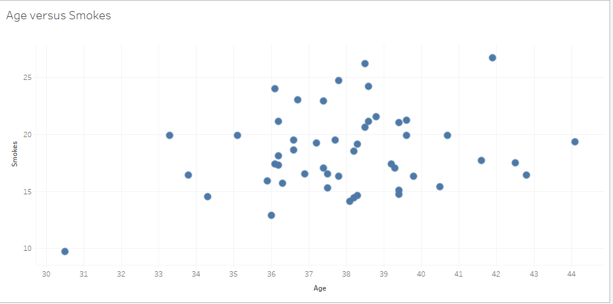

# D3 Homework - Data Journalism and D3

### Core Assignment: D3 Dabbler (Required Assignment)
RESULTING GRAPH FOR REFERENCE

Correlations Discovered Between Smokers and Age:

First Correlation found between smokers and age includes: A greater amount of smokes occur between the ages of 36-40 than any other ages represented in data with a majority of the smokes between 14-24.

Second Correlation found between smokers and age includes:The state with the highest amount of smokes is West Virginia with an age of 41.9; the state with the lowest amount of smokes is Utah with smokes of 9.7 and an age of 30.5.

Third Correlation found between smokers and age includes: Age 36-38 had the largest amount of smokers that have at least 15-20 smokes.

